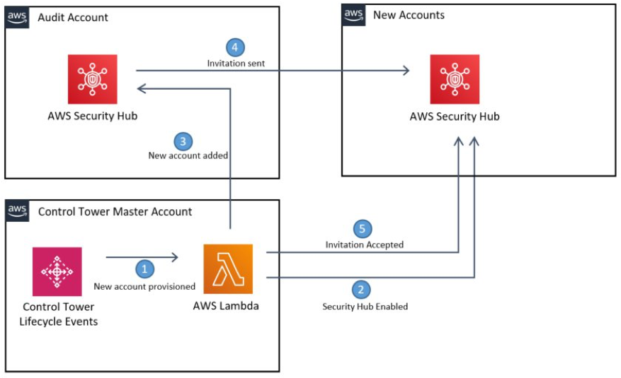

# Centralize SecurityHub

Installing this Customization will enable Security Hub in all Control Tower managed accounts, with the Audit account acting as the default Security Hub Master.

This is done by deploying a SecurityHub Enabler lambda function in the master account. It runs periodically and checks each Control Tower managed account/region to ensure that they have been invited into the master SecurityHub account and that SecurityHub is enabled.  It is also triggered by Control Tower Lifecycle events to ensure there is minimal delay between new accounts being created and Security Hub being enabled in them.

### Attributions

The original code for automating SecurityHub enablement in AWS accounts is present [here](https://github.com/awslabs/aws-securityhub-multiaccount-scripts). This has been extended to work with Control Tower.

The cfnResponse module has recently been impacted by [removal of the vendored version of requests from botocore](https://aws.amazon.com/blogs/developer/removing-the-vendored-version-of-requests-from-botocore/), so the send function has been directly imported from [here](https://docs.aws.amazon.com/AWSCloudFormation/latest/UserGuide/cfn-lambda-function-code-cfnresponsemodule.html).

## Instructions

1. Upload the src/securityhub_enabler.zip file to an S3 bucket, note the bucket name
1. Gather other information for deployment parameters:

    - In AWS Organizations, look on the Settings page for the Organization ID.  It will be o-xxxxxxxxxx
    - In AWS Organizations, look on the Accounts page for the Audit account ID.

1. Launch the CloudFormation stack using the aws-control-tower-securityhub-enabler.template file as the source.  The values noted in the steps above will be entered as parameters to the CloudFormation stack.  
